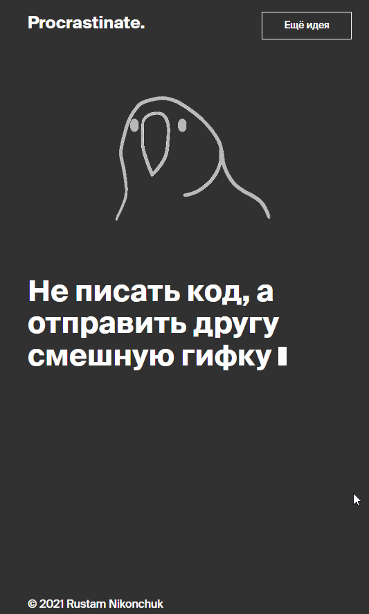

# «Procrastinate»
HTML, CSS, JavaScript: вводный модуль.  "Веб-разработчик плюс" в Яндекс Практикуме.

---
### Сведения об образовательном учреждении

**АНО ДПО "ШКОЛА АНАЛИЗА ДАННЫХ"** 
* ОГРН: 1147799006123 ИНН: 7704282033
* Место нахождения образовательной организации: 119021, Россия, г. Москва, ул. Тимура Фрунзе, д. 11, корпус 2
* Почтовый адрес: 115035, город Москва, ул. Садовническая, д. 82, стр. 2
* Контактный телефон: _+7 (495) 739-70-00_
* Электронная почта: _shad@yandex-team.ru_

---

## О проекте:

**_«Procrastinate» представляет собой приложение на JavaScript, которое позволит расслабиться и сделать перерыв. Зайдите в него, нажмите на кнопку и получите совет. Пусть в наших соцсетях продуктивным сверхлюдям станет чуть спокойнее._**

- _[сылка на проект в GitHub Pages](https://rus29tam.github.io/Procrastinate./)_

 1. Применены правила HTML-разметки
 2. Освоена работа со стилями: управление цветом, шрифтами, расположением блоков на странице. 
 3. Освоен базовый синтаксис HTML и CSS, а также минимально необходимый набор тегов и стилистических правил.

---

### Об авторе:

**Рустам Никончук** 
* Стутент 15-й когорты
* Начало обучения 16 мая 2022 г. 
* Опыт в программировании до поступления - отсутствует.

---
#### Контактные данные 

* e-mail: _rustam.nikonchuk@yandex.ru_
* phone: _+79212922232_

